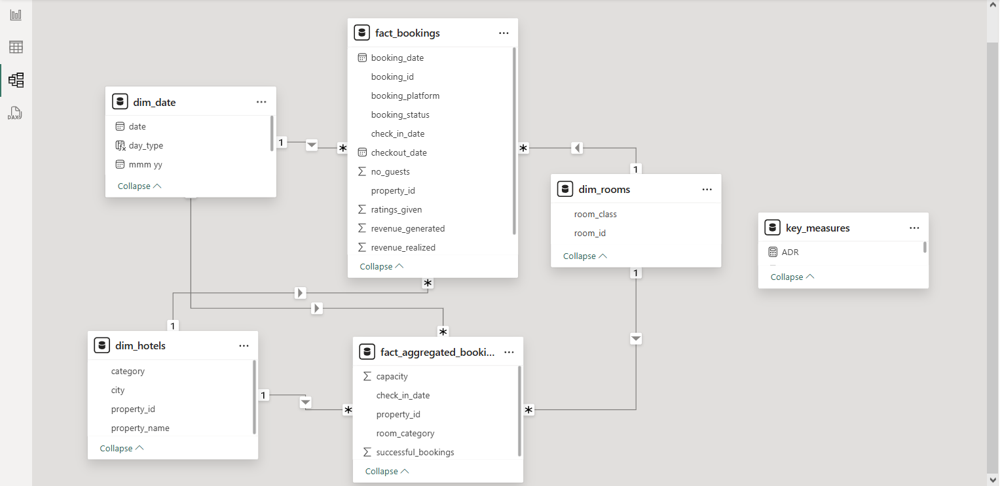
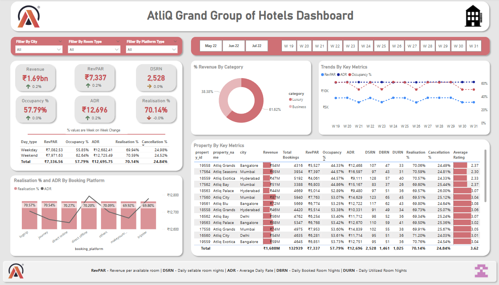
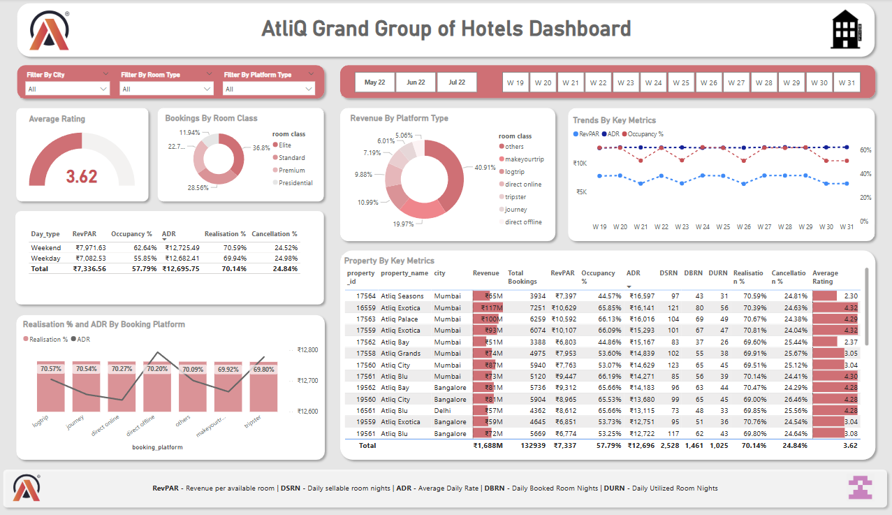
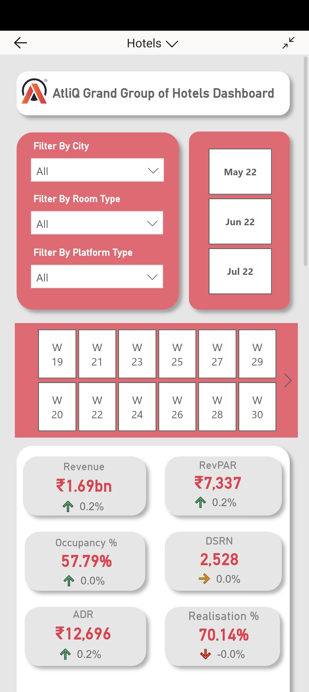
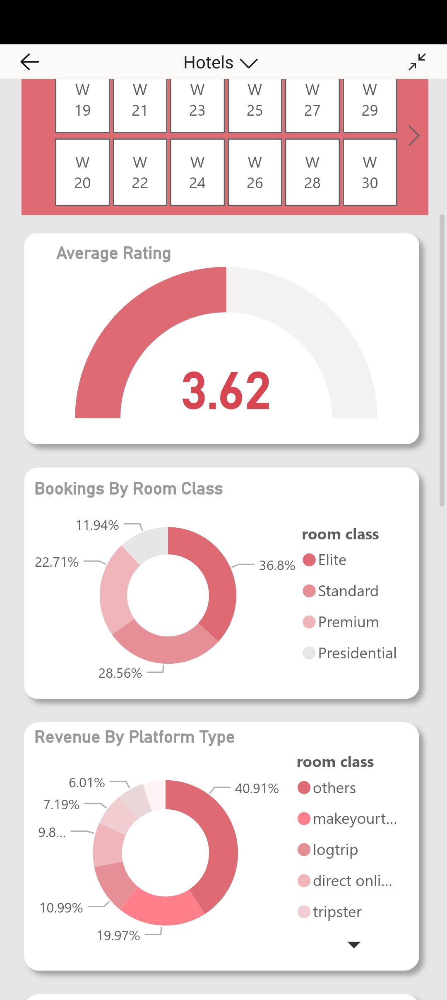

# Atliq-Hotel-Dashboard
A comprehensive Power BI dashboard developed for AtliQ Grands, a fictional luxury hotel chain operating across major Indian cities. The project aims to analyze booking patterns, revenue streams, and occupancy metrics to provide actionable insights for strategic decision-making.

Link to [Interactive Dashboard](https://app.powerbi.com/links/b28iJchmvG?ctid=850aa78d-94e1-4bc6-9cf3-8c11b530701c&pbi_source=linkShare)

## Project Overview
AtliQ Grands is a renowned five-star hotel chain with properties in Mumbai, Delhi, Bangalore, and Hyderabad. Despite its premium offerings, the chain has been experiencing a decline in revenue and market share due to increased competition and static pricing strategies.

## Objective
Analyze hotel bookings, room capacity, and guest behavior to build a powerful dashboard that:
- Tracks core KPIs: ADR, RevPAR, Occupancy, Realisation, and Revenue
- Compares performance across city, room type, date, and booking platform
- Identifies strategic insights to improve operations and pricing

## 🧰 Tools & Technologies Used
- **Power BI**: Dashboard creation and DAX-based calculations
- **DAX (Data Analysis Expressions)**: To compute custom measures like RevPAR, Realization
- **Power Query**: Data transformation layer
- **Excel/CSV**: Raw data source format
- 
## 📂 Datasets
Worked with five core datasets:

| Dataset                    | Description                                                                 |
|---------------------------|-----------------------------------------------------------------------------|
| `dim_date.csv`            | Calendar data including weekend/weekday info                                |
| `dim_hotels.csv`          | Hotel metadata (property ID, city, category)                                |
| `dim_rooms.csv`           | Room types and classes                                                      |
| `fact_aggregated_bookings.csv` | Aggregated room-level data including availability and booking volume        |
| `fact_bookings.csv`       | Customer-level booking data with status, platform, revenue and rating info |

## Data Model 

    

## 📊 Dashboard Highlights
- 📈 **KPI Cards**: RevPAR, ADR, Occupancy, Realization
- 🗓️ **Monthly & Weekly Trends**: Booking patterns over May, June, and July
- 🏙️ **City-wise Comparison**: Filterable insights for Mumbai, Delhi, Bangalore, Hyderabad
- 💰 **Platform Performance**: Revenue vs realization by booking channels
- 🛏️ **Room Category Analysis**: Performance across Standard, Elite, Premium, Presidential
- 📱 **Mobile Layout**: Optimized version for quick viewing on handheld devices

### Desktop View

    

    

### Mobile View

    

    

## 🔍 Key Business Insights
1. **Lack of Dynamic Pricing**: ADR is constant across peak and off-peak periods, revealing missed revenue opportunities.
2. **Underutilization of Weekend Strategy**: Day-type analysis shows negligible pricing difference between weekdays and weekends.
3. **Platform Pricing Gaps**: Own website shows highest ADR but lower volume due to underpromotion and no differential strategy.
5. **Presidential Rooms Lagging**: Low realization for high-end rooms suggests need for bundled deals or targeted offers.
6. **Realization Trends**: Low realization from certain platforms points to no-shows or cancellations – a case for better channel management.
